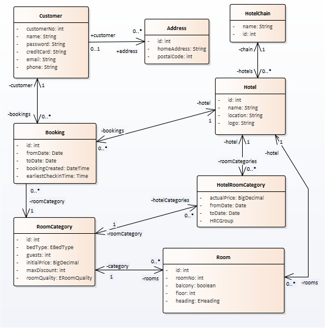
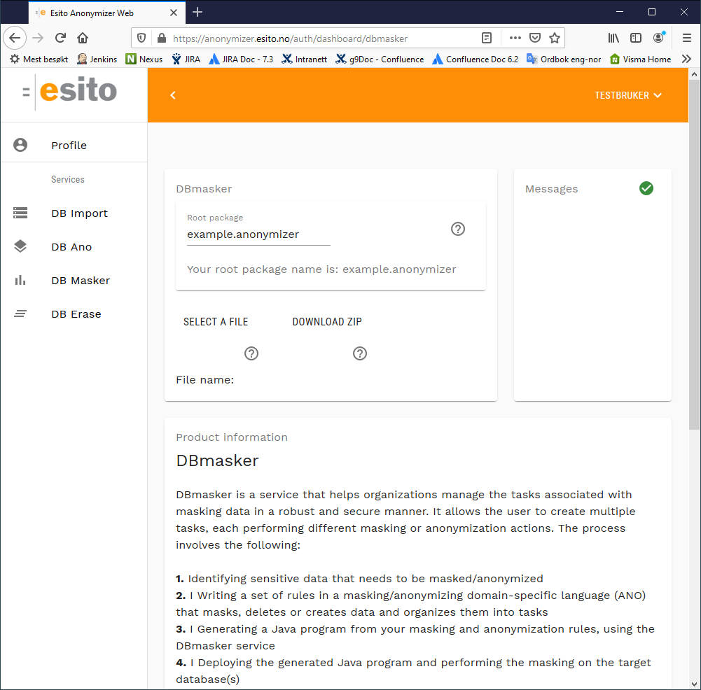

# DBmasker

This project contains resources for [DBmasker](http://www.esito.no/dbmasker) example project. It demonstrates anonymization/masking of a hotel booking systems database and some GDPR tasks. The example consists of the combination of this github project and use of the DBmasker service.

## Prerequisites to run the program ##

The example uses Java, Maven and Derby database. It is tested with the versions:

- java 1.8
- maven 3.6.1
- derby 10.14.2.0

### Derby install ###

Download [Derby](https://db.apache.org/derby/derby_downloads.html), unzip to a folder of your choice. 

## Using the samples ##

Download and unzip this project to a java project (`dbmasker`) or clone the repository: 

	git clone https://github.com/esito/dbmasker.git

Files which are part of the project:

- `hotelsample\hotelsample.ano`: describes masking rules, input to the DBmasker service
- `hotelsample\config.properties`: database connection settings
- `hotelsample\src\main\java`: source files which represents custom implementations
- `hotelsample\src\main\resources`: text files used in the masking process
- `hotelsample\database`: database files
	- schema to create a derby database
	- insert statements to populate the database

### Create and populate the database ###

Open a command shell and go to the directory `hotelsample/database`. Open the database creation script `create-db.cmd` (Windows) or `create-db.sh` (Linux or Mac) and edit `DERBY_HOME` to point to your Derby installation folder containing the libs. 

Run the create-db script. It will create the `database/hotelsample` folder, containing the Derby database populated with sample data.

### Investigate the ANO file ###

From the hotelsample folder, look at the `hotelsample.ano` file. It contains a program written in the **ANO** DSL language which consists of

- description of database structure
- a lot of tasks and rules describing how to anonymize, mask, create and remove data

The syntax is described in [http://dbmasker.esito.no/help/topic/no.esito.g9.doc.dbservices/DBmasker.html](http://dbmasker.esito.no/help/topic/no.esito.g9.doc.dbservices/DBmasker.html). 

The simplified domain model for this sample project:

### Generate the anonymization/masking program code ###

Go to the [http://anonymizer.esito.no](http://anonymizer.esito.no) web, register a user and subscribe to the DBmasker service.

Go to the DBmasker service on [http://anonymizer.esito.no/auth/dashboard/dbmasker](http://anonymizer.esito.no/auth/dashboard/dbmasker). Choose **SELECT A FILE** and use the `hotelsample.ano` file as the **Anonymizer model File name** parameter to the service. Ignore the **Root package** parameter (giving `example.anonymizer` package value) and press the **DOWNLOAD ZIP** button.

The project `dbmasker-master/hotelsample` will look like this before unzipping the result:

    database/*
    src/main/java/example/anonymizer/conversions/ParseDigits.java
    src/main/java/example/anonymizer/distributions/MinPerParent.java
    src/main/java/example/anonymizer/transformations/PostCodeGeneralization.java
    src/main/java/example/anonymizer/Connect.ovr
    src/main/resources/email.txt
    src/main/resources/firstname.txt
    src/main/resources/lastname.txt
    src/main/resources/logo.txt
    src/main/resources/town.txt
    address_map.txt
    config.properties
    hotelsample.ano

Unpack the resulting zip to the java project you downloaded/cloned from github. Unzip the structure into the `hotelsample` folder. The `pom.xml` and `readme.md` will be copied to the `hotelsample` project root.  Generated code is written to the `src` folder. It is regenerated each time the **DBmasker** service is used. Be aware of that customizations might be overwritten each time it is regenerated. 

## Prepare and setup ##

### Connect class ###

The **DBmasker** generator creates `hotelsample\src\main\java\example\anonymizer\Connect.java`, which connects to the database given by the `config.properties` file. In this example, we have to override the `Connect.java` with a user defined Connect. Replace the content in `hotelsample\src\main\java\example\anonymizer\Connect.java` with the code from `src/main/java/example/anonymizer/Connect.ovr`: 

    package example.anonymizer;
    
    import java.sql.Connection;
    import java.net.InetAddress;
    import no.esito.anonymizer.ConfigUtil;
    import no.esito.anonymizer.core.AbstractConnect;
    import org.apache.derby.drda.NetworkServerControl;
    
    public class Connect extends AbstractConnect{
    
    	/**
    	 * Factory method for Connection from the config.properties
    	 * @return Connection
    	 * @throws Throwable Connection exceptions
    	 */
    	public static Connection createDefaultConnection() throws Throwable {
    	    return new Connect().makeConnection("",ConfigUtil.getConfig());
    	}
    
        public NetworkServerControl nsc;
    
    	@Override
    	protected void checkNetworkService(String host, String port) throws Throwable {
    	    if (nsc == null) {
    	        InetAddress inet = InetAddress.getByName(host);
    	        nsc = new NetworkServerControl(inet, Integer.parseInt(port));
    	        nsc.start(null);
    	        System.out.println("Starting Derby: "+ port);
    	    }
    	}
    }

### Using Maven, edit pom.xml ###

The generated source may be built using Maven. Add the Derby dependencies to the `pom.xml` file and change the version number to fit your Derby installation:

    <properties>
        <derby.version>10.14.2.0</derby.version>
    </properties>
    
    <dependency>
        <groupId>org.apache.derby</groupId>
        <artifactId>derbyclient</artifactId>
        <version>${derby.version}</version>
    </dependency>
    <dependency>
        <groupId>org.apache.derby</groupId>
        <artifactId>derbynet</artifactId>
        <version>${derby.version}</version>
    </dependency>
    <dependency>
        <groupId>org.apache.derby</groupId>
        <artifactId>derby</artifactId>
        <version>${derby.version}</version>
    </dependency>

To build the hotelsample program, run **mvn install**, which creates the `hotelsample-0.0.1.jar` in the `target` folder.

### Edit config.properties ###

If necessary, edit the database properties in the config.properties file:

	# Database connection parameters
	connection.host         = localhost
	connection.port         = 1527
	connection.db           = database/hotelsample
	connection.schema       = APP
	connection.user         =
	connection.password     =
	connection.driverClass  = org.apache.derby.jdbc.ClientDriver
	connection.url          = jdbc:derby://<host>:<port>/<db>;create=false
	file.encryptionkey      = passkey890123456

## Run the generated application ##

To test the generated code, start a command shell and run this command from the hotelsample folder: **java -jar target/hotelsample-0.0.1.jar cmd**

The program name **hotelsample** is given by your input `hotelsample.ano` file name. "`cmd`" is a command that takes continued input from standard input. The program displays the command help text and is ready for commands.

	Commands:
	trace                 - shows more messages
	help                  - shows this page
	config                - creates a local config.properties used for changing connection parameters
	ping                  - test database connection
	tasks                 - outputs list of tasks
	run                   - runs all tasks except erase and sar tasks
	run <tasks>           - runs a list of space delimited tasks, erase and sar actions are excluded
	erase <task> <params> - runs erase actions for a specified task with a series of space delimited
	                        parameters. If parameter contains a space, surround it with quotation marks
	sar <task> <params>   - creates a SAR export for a specified task with a series of space delimited
	                        parameters. XML and JSON files will be created in the working directory
	cmd                   - takes continued input from standard input (stdin)
	quit                  - quits program
	>

Check that the database connection is ok: run the **ping** command:

	>ping
	Reading local config from C:\temp\hotelsample\config.properties
	Starting Derby: 1527
	DBMS: Apache Derby - 10.14.2.0 
	Driver: Apache Derby Network Client JDBC Driver - 10.14.2.0 - 10.14
	URL: jdbc:derby://localhost:1527/database/hotelsample;create=false
	Connection succesful
	>

Turn on verbose mode, run the **trace** command.

A set of tasks is defined, to see the list, run the **tasks** command:

	Available tasks:
	Anonymize
		Anonymize_CUSTOMER (CUSTOMER - CREDITCARD EMAIL NAME PHONE)
		Anonymize_ROOMCATEGORY (ROOMCATEGORY - INITIALPRICE)
		Delete_HOTELCHAIN (HOTELCHAIN)
		Fix_ADDRESS (ADDRESS - POSTALCODE)
	Create
		Create_HOTELCHAIN (HOTELCHAIN)
		Create_HOTEL (HOTEL)
		Create_ROOM (ROOM)
	Advanced
		Anonymize_HOTEL (HOTEL - NAME)
		Anonymize_ADDRESS (ADDRESS - HOMEADDRESS)
		Anonymize_ROOMCATEGORY (ROOMCATEGORY - ID)
		Anonymize_BOOKING (BOOKING - BOOKINGCREATED EARLIESTCHECKINTIME FROMDATE ID TODATE)
		Anonymize_ROOM (ROOM - ID)
		Anonymize_HOTELROOMCATEGORY (HOTELROOMCATEGORY - ACTUALPRICE FROMDATE TODATE)
	ForgetMe
		Erase_CUSTOMER (CUSTOMER)
		Erase_HOTELROOMCATEGORY (HOTELROOMCATEGORY)
	SubjectAccess
		SAR_CUSTOMER (CUSTOMER)

Each of these tasks may be run with the run command:

Run a group of tasks as in **run anonymize** or run a single task as in **run fix_address**.
You may use lower case letters on all task names.

Check how the mask, create and delete tasks work:

- investigate the content of the database
- check how the tasks and rules are defined
- run the tasks, one at the time
	- run anonymize
	- run create
	- run advanced
- check the database result

To run Erase and SAR tasks, use the erase and sar commands. Look at the definition of the tasks which are defined with a parameter. To run the tasks defined:

- erase erase_customer 1000234 (parameter customer id)
- erase erase_hotelroomcategory 1 11 2005-10-15 (parameters hotel id, roomcategory id and fromdate)
- sar subjectaccess 1000234 (parameter customer id)

To stop the program, run **quit**.

### Sample database session ###

To look at the Derby database content using the SQL client `ij`, run `run-ij.cmd` or `run-ij.sh` found in the database folder:

Note that `DERBY_HOME` in `run-ij.cmd` or `run-ij.sh` must point to your derby folder.

Note that only one instance may access the database at the time, so you may need to exit the running `java -jar target/hotelsample-0.0.1.jar` instance to run `ij` and look at the content in Derby database. Otherwise you will get an error that the instance is already running.

	>./run-ij.sh
	ij version 10.14
	ij> connect 'jdbc:derby:hotelsample;create=false';
	ij> select * from hotel;
	ID    |LOCATION             |LOGO        |NAME                              |CHAIN_ID   |LOCK_FLAG
	--------------------------------------------------------------------------------------------------
	1     |Waterside meact      |Logo1       |Antique Canyon Hotel              |1          |NULL
	2     |West kainnict        |Logo2       |Ivory Refuge Hotel & Spa          |1          |NULL
	3     |South tasiob         |Logo3       |Historic Heritage Resort & Spa    |1          |NULL
	4     |Andebu               |Logo4       |Sunny Jungle Resort & Spa         |1          |NULL
	5     |Waterside gramict    |Logo5       |Sunny Ribbon Resort               |1          |NULL
	6     |Bergen               |Logo6       |DeLuxor                           |1          |NULL
	7     |Tronheim             |Logo7       |Da Hood                           |1          |NULL
	8     |Nuword Garden        |Logo8       |Royal Ocean Hotel                 |1          |NULL
	9     |Cunnic Center        |Logo9       |Grand Hotel                       |1          |NULL
	10    |Lillehammer          |Logo10      |Prism Hotel                       |1          |NULL
	11    |Sandvika             |Logo11      |The House of Dilbert              |1          |NULL
	12    |Feered West          |Logo12      |Grand Resort                      |1          |NULL
	13    |Oslo                 |Logo13      |Cloud Hotel                       |1          |NULL
	14    |Midtown buwan        |Logo14      |Mellow Panorama Hotel             |2          |NULL
	15    |Little drud          |Logo16      |Emerald Hotel                     |0          |NULL
	
	15 rows selected
	ij>